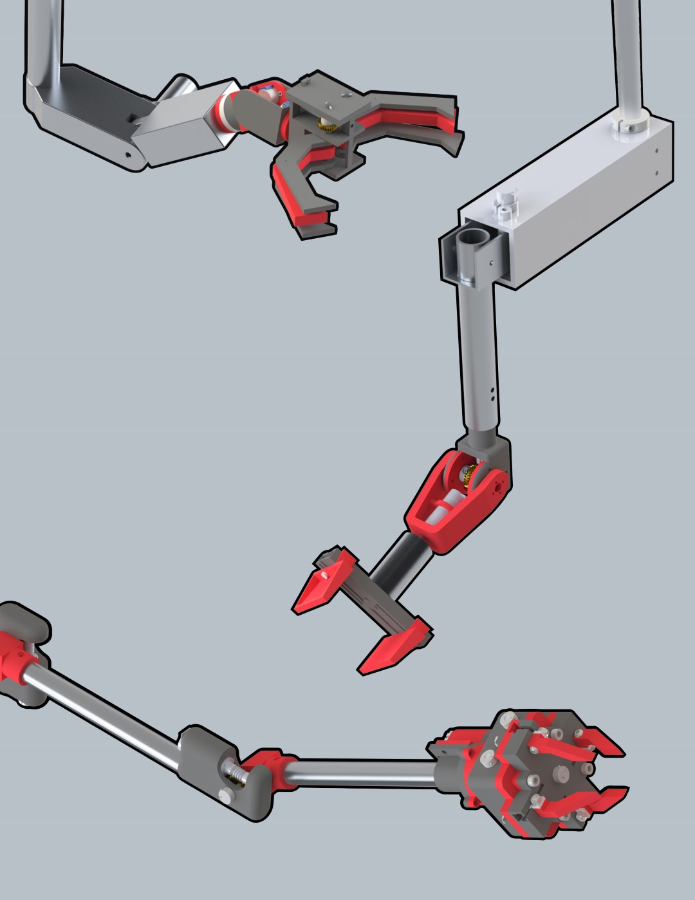

  

    

      The Canadian International Rover Challenge is R3’s newest competition. It occurs twice a year and draws teams from around the world: in Drumheller, Alberta in the summer, and in Paris, Ontario in the winter. Winter 2021 will be R3’s first entry into this challenge. CIRC gives us a great opportunity to develop the Rover systems for new and different challenges than we’ve been exposed to at URC while educating and training our new members, molding them into the engineers of the future.
      

    

	   

        
	   

