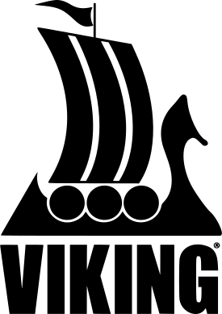

 

<h1 style="vertical-align: middle; color:#000000;">Thank you to our generous sponsors!</h1>

{: class="sponsorLogo"}    {: class="sponsorLogo"}   {: class="sponsorLogo"}

{: class="sponsorLogo"}    {: class="sponsorLogo"}    {: class="sponsorLogo"}

{: class="sponsorLogo"}    {: class="sponsorLogo"}   {: class="sponsorLogo"}

{: class="sponsorLogo"}    {: class="sponsorLogo"}   {: class="sponsorLogo"}   {: class="sponsorLogo"}


<section class="tiles">
    <article style="width: 100%;">
        
            
        
        <header class="major" style="">
            <h3><a href="sponsorship.html" class="link">Sponsorship</a></h3>
            
Learn more about the benefits of sponsoring us

        </header>
    </article>
</section>

