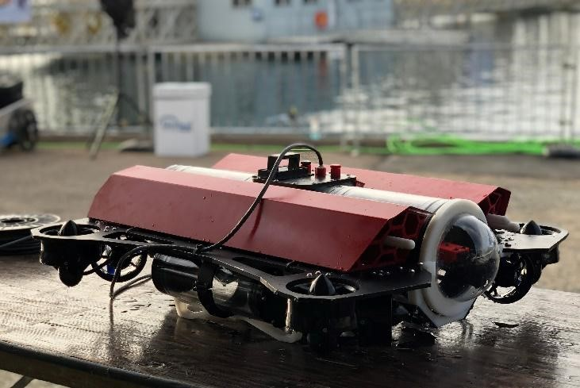
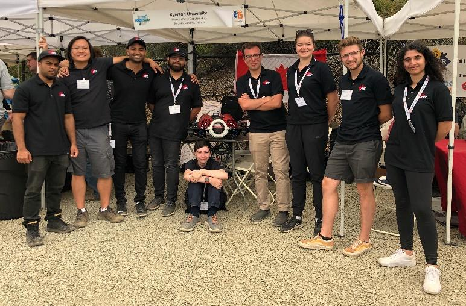

RoboSub is R3’s most advanced project to date, the primary objective of the RoboSub team is to design and manufacture a submarine competitive enough to compete at a high level within the RoboSub competition.

{:style="float: right; margin-left: 1cm; margin-bottom: 1cm;"} The sub or Felix as we call it, features some of the most involved design work completed for a R3 project. Felix comes from a common design philosophy within the robosub community; a holonomic thruster configuration for yaw manuevers and translations in the XY plane and, coupled Z facing thrusters for upward translations as well as roll and pitch maneuvers. 

The large aluminum wings serve two purposes; to hold the thrusters in place and, to provide drag during roll and pitch maneuvers. A lot of time was devoted to designing a small, symmetric and maneuverable submarine. 

{:style="float: left; margin-right: 1cm; margin-bottom: 1cm;"} Felix’s control system is one of the most advanced that R3 has developed. Felix runs its navigation and object detection on a Nvidia Jetson TX2, paired with STM32 microcontrollers for high speed I/O for sensor data collection and thruster controller. The microcontrollers are mounted onto custom shield boards with the power, signal processing, and low-level communication hardware.

Felix’s control system also features a very sophisticated control algorithm, responsible for handling tasks such as generating inputs for the cascaded PID to output to the thrusters or running the YOLO V3 neural network which we trained to detect the gate, buoys, and other competitions objectives. 

We are very happy to announce that all of our work went into achieving a score of 18th in our first year at the RoboNation RoboSub competition.

<iframe width="560" height="315" src="https://www.youtube.com/embed/4EaoVBWqIN8" frameborder="0" allow="accelerometer; autoplay; encrypted-media; gyroscope; picture-in-picture" allowfullscreen></iframe>
