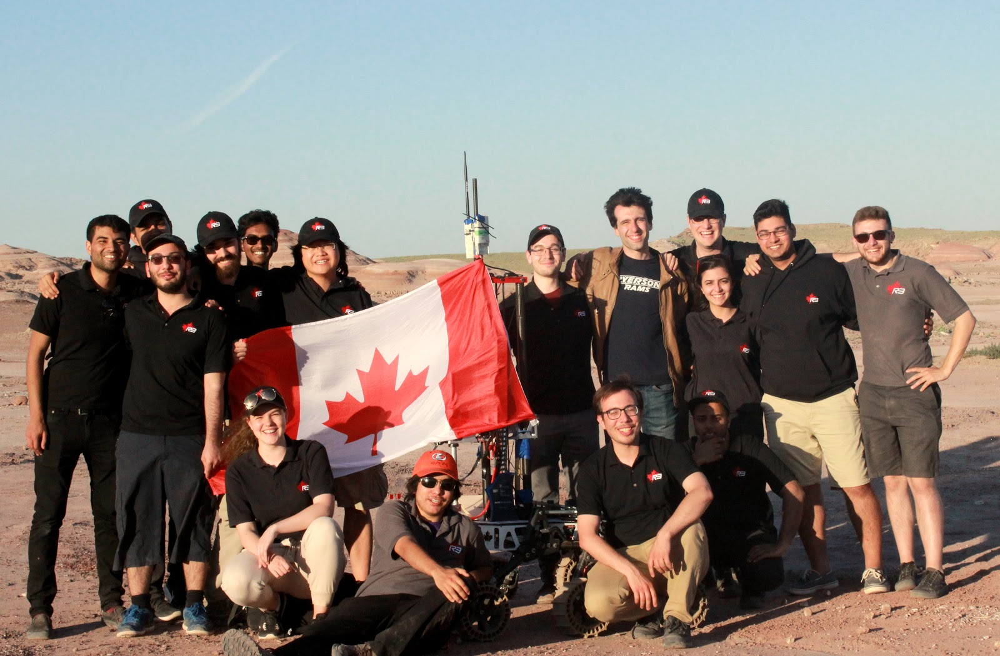

<!-- Spotlights -->
<section id="two" class="spotlights">
	<section>
		

			

				

					R3 has been developing and testing mars rovers for the University Rover Challenge for the past three years with the original aim of placing in the top 5. Since our original entry, we have placed 21st in our first year (2017), 15th in our second year (2018) and 2nd  in the 2019 competition. The current goals are to continue to develop high scoring rovers in the hopes of winning the competition, and to be a regular podium contender.
				

			

		

	</section>
	<section>
		

			
		

		

			

        

          Mechanically, Navi is set apart by its double-lambda bogie suspension system and fully modular cylindrical coordinate arm. This allows it to easily traverse almost any terrain and pick and place incredibly quickly. Additionally, with its high power drivetrain, Navi is by far the fastest rover at URC. The simplicity and elegance of the arm design allows direct control with no need for inverse kinematics as well as the ability to swap end effectors depending on the task.
        

        

          What makes Navi's control system different from previous years is the increased focus on design simplicity. Its communications protocols have been changed to utilize more open source software, allowing our students to focus more on testing and low level design. The rover also implements a unique autonomous system, utilizing a YOLO V3 algorithm for image detection and avoidance paired with a GPS and IMU for global path planning.
        

			

		

	</section>
	<section>
		

			
		

		

			

        

          The amazing students we have working on this project and their efforts in implementing and developing this rover concept and design over the past three years have allowed us to place 2nd in the 2019 competition and will continue to allow us to develop high level rovers.
        

			

		

	</section>
</section>

  <iframe width="560" height="315" src="https://www.youtube.com/embed/HChMw8dtmZw" frameborder="0" allow="accelerometer; autoplay; encrypted-media; gyroscope; picture-in-picture" allowfullscreen></iframe>

